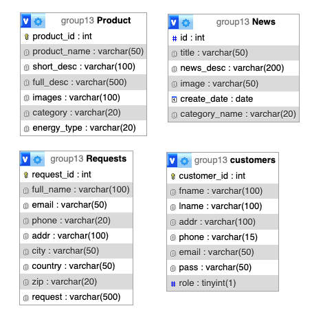

Repository link:
https://github.com/hiephamk/Web_PHP_Group_13.git

# Website for Car Producing Company - Team 13

The website will serve as a comprehensive product showcase platform for a car producing company. The website will display the company news, product descriptions and contact information.

## Members
1. Huynh Van Hiep
2. Vu Quang Dan
3. Tran Huynh An Duy
4. Nguyen Dinh Khanh Chi

## Table of Contents
- [Features](#features)
- [Database Tables](#database-tables)
- [Created Forms](#created-forms)
- [Created Tables](#created-tables)

---

## Features

In this section, list and describe the features or functionality we are working on.

- [x] Feature 1 (Nguyen Dinh Khanh Chi): Products management (View, Insert, Update, Delete)
- [x] Feature 2 (Vu Quang Dan): Feedback & request for Contact page
- [x] Feature 3 (Tran Huynh An Duy): Add a filter for News page
- [x] Feature 4 (Huynh Van Hiep): Member registration 
- [x] Feature 5 (Huynh Van Hiep): Member login
- [x] Feature 6 (Huynh Van Hiep): Update the user's profile
- [x] Feature 7 (Huynh Van Hiep): Search product - on the header of all pages

### Feature 1: Product management
This feature applying CRUD app typically allows users to browse the existing product list and perform further actions (add new items, change field details, remove items) via a user-friendly interface.
- [Github links to related code files](https://github.com/hiephamk/Web_PHP_Group_13/blob/main/product-manage.php)
- [HAMK Shell link to the feature](http://shell.hamk.fi/~dinh23000/team-13-project/product-manage.php)

### Feature 2: Request
Customers can send their feedback or requests via the contact form. Data will be stored in the appropriate table.
- [Github links to related code files](https://github.com/hiephamk/Web_PHP_Group_13/blob/main/Contact.php)
- [HAMK Shell link to the feature](http://shell.hamk.fi/~dan23000/Web_PHP_Group_13/Contact.php)

### Feature 3: Filter News
Users will filter news based on a specific category.
- [Github links to related code files](https://github.com/hiephamk/Web_PHP_Group_13/blob/main/News-filter.php)
- [HAMK Shell link to the feature](http://shell.hamk.fi/~duy23000/Team-13/News-filter.php)

### Feature 4: Member register
Users will fill in their email and password to sign up for our membership.
- [Github links to related code files](https://github.com/hiephamk/Web_PHP_Group_13/blob/main/register.php)
- [HAMK Shell link to the feature](http://shell.hamk.fi/~hiep23000/Web_php_group_13/register.php)

### Feature 5: Login
Users can sign in to their account after registering.
- [Github links to related code files](https://github.com/hiephamk/Web_PHP_Group_13/blob/main/login.php)
- [HAMK Shell link to the feature](http://shell.hamk.fi/~hiep23000/Web_php_group_13/login.php)

### Feature 6: Update profile
Members can view their profile to update personal information such as address and phone number.
- [Github links to related code files](https://github.com/hiephamk/Web_PHP_Group_13/blob/main/profile.php)
- [HAMK Shell link to the feature](http://shell.hamk.fi/~hiep23000/Web_php_group_13/profile.php)

### Feature 7: Search
We will make the search button interactive and working, and it will also show the result on a new page.
- [Github links to related code files - Search function](https://github.com/hiephamk/Web_PHP_Group_13/blob/main/search.php)
- [Github links to related code files - Show search result](https://github.com/hiephamk/Web_PHP_Group_13/blob/main/product-search.php)
- [HAMK Shell link to the feature](http://shell.hamk.fi/~hiep23000/Web_php_group_13/product-search.php)

---

## Database Tables

List the database tables that are part of our project. 

- Table 1 (Created by dinh23000): Product
- Table 2 (Created by hiep23000): Customers
- Table 3 (Created by dan23000): Requests
- Table 4 (Created by duy23000): News

> Include the ER Diagram of the database. 

---

## Created Forms

List and describe forms that have been created as part of our project. Include details about the purpose of each form and any validation logic.

#### Form 1 (Created by Nguyen Dinh Khanh Chi):
 - Form name: [Product Insert Form](https://github.com/hiephamk/Web_PHP_Group_13/blob/main/sub_page/product-create.php) 
 - Purpose: To add items to the table "Product" in the database.
 - Validations Applied: Product name is required and image link will be checked for invalid URL.

#### Form 2 (Created by Nguyen Dinh Khanh Chi):
 - Form name: [Product Update Form](https://github.com/hiephamk/Web_PHP_Group_13/blob/main/sub_page/product-edit.php) 
 - Purpose: To change field details into table "Product" in database.
 - Validations Applied: Product name is required and image link will be checked for invalid URL.

 #### Form 3 (Created by Nguyen Dinh Khanh Chi):
 - Form name: [Product Delete Form](https://github.com/hiephamk/Web_PHP_Group_13/blob/main/sub_page/product-delete.php) 
 - Purpose: To remove items from table "Product" in database.
 - Validations Applied: Product name is required and image link will be checked for invalid URL.

#### Form 4 (Created by Vu Quang Dan):
 - Form name: Requests Form 
 - Purpose:
 - Validations Applied:

#### Form 5 (Created by Huynh Van Hiep):
 - Form name: Login Form 
 - Purpose: 
 - Validations Applied:

#### Form 6 (Created by Huynh Van Hiep):
 - Form name: Register Form 
 - Purpose: 
 - Validations Applied:

#### Form 7 (Created by Tran Huynh An Duy):
 - Form name: [Filter Form] (https://github.com/hiephamk/Web_PHP_Group_13/blob/main/display-data.php)
 - Purpose: Display the news based on news category
 - Validations Applied: None

---

## Created Tables

List tables that we have created in the project work.

- Table 1 (Created by dinh23000): Product View & Modification 
 + [Github Link](https://github.com/hiephamk/Web_PHP_Group_13/blob/main/sub_page/product-manage.php) 
 + [Link to the table](http://shell.hamk.fi/~dinh23000/team-13-project/product-manage.php).

- Table 2 (Created by dan23000): Table Name 
 + [Github Link]()
 + Link to the table (shell.hamk.fi).

- Table 3 (Created by hiep23000): Table Name | Link to the related code file (github) | Link to the table (shell.hamk.fi).

- Table 4 (Created by duy23000): Display News base on Filter
  + [Github Link](https://github.com/hiephamk/Web_PHP_Group_13/blob/main/News-filter.php)
  + [Link to the table](http://shell.hamk.fi/~duy23000/Web_PHP_Group_13/News-filter.php)

---
